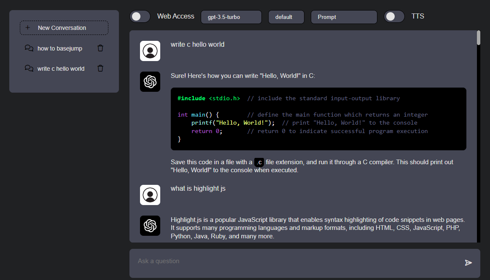

## ChatGPT local client  

```
python -m venv venv  
bash:  
    source venv/bin/activate  
windows:  
    venv\Scripts\activate  
pip install -r requirements.txt  
python run.py  
```

##### Configure config.json  

| Env Variable    | config.json    | examples                                           |
|-----------------|----------------|----------------------------------------------------|
| OPENAI_API_KEY  | openai_key     | sk-...                                             
| OPENAI_API_BASE | openai_api_base | https://api.openai.com <br> https://openai.azure.com <br> http://my-reverse-proxy/  

edit client/data/predefined_prompts.json.  

  
